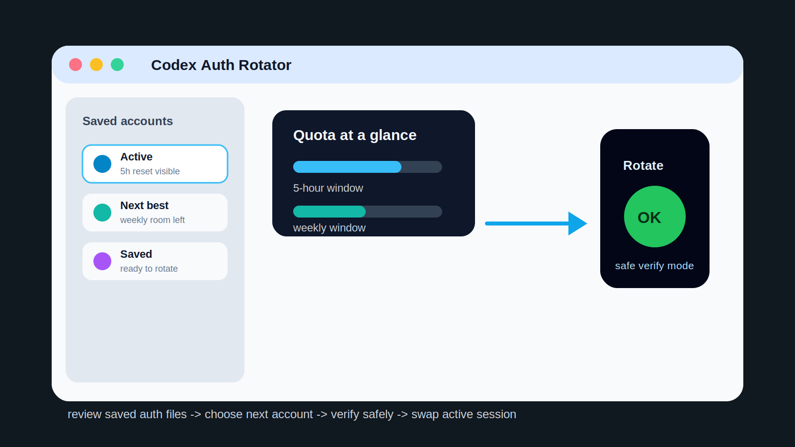

# Codex Auth Rotator



Codex Auth Rotator is a compact native macOS app for reviewing saved Codex auth files, watching quota status, and switching between accounts from one place.

## What It Does

- Scans a chosen root folder for saved `auth.json` account folders.
- Shows active, saved, and recommended next accounts in a focused desktop UI.
- Reads quota information from the active Codex OAuth session first, then falls back to CLI data where useful.
- Updates account folder labels with compact usage and reset information.
- Removes exact duplicate auth folders when they only contain `auth.json`.
- Swaps the active Codex auth file after closing Codex-related apps.

## Highlights

- **Native Mac workflow:** packaged as a Swift app rather than a terminal-only helper.
- **Quota-aware switching:** helps choose the next account without opening every saved auth file by hand.
- **Safe verification mode:** test runs use disposable auth data and do not relaunch real Codex windows.
- **Focused scope:** the app handles account review and rotation without changing the Codex app itself.

## Quick Start

```bash
./script/build_and_run.sh
```

Safe verification mode:

```bash
./script/build_and_run.sh --verify
```

Run the automated suite:

```bash
swift test
```

## Project Map

| Path | Purpose |
| --- | --- |
| `Package.swift` | Swift package and target definitions |
| `Sources/CodexAuthRotator` | macOS app entrypoint and UI |
| `Sources/CodexAuthRotatorCore` | Account scanning, quota, and rotation logic |
| `Tests` | Unit and behavior checks |
| `script/build_and_run.sh` | Preferred local build and launch wrapper |

## Testing

Use `./script/build_and_run.sh --verify` for a safe local smoke run, then `swift test` for the full test suite. Verification mode is the preferred first check because it avoids touching real Codex windows or real active auth state.

## Notes

This repository presents the public app code and safety-first workflow. It does not require changes to the Codex desktop runtime.

